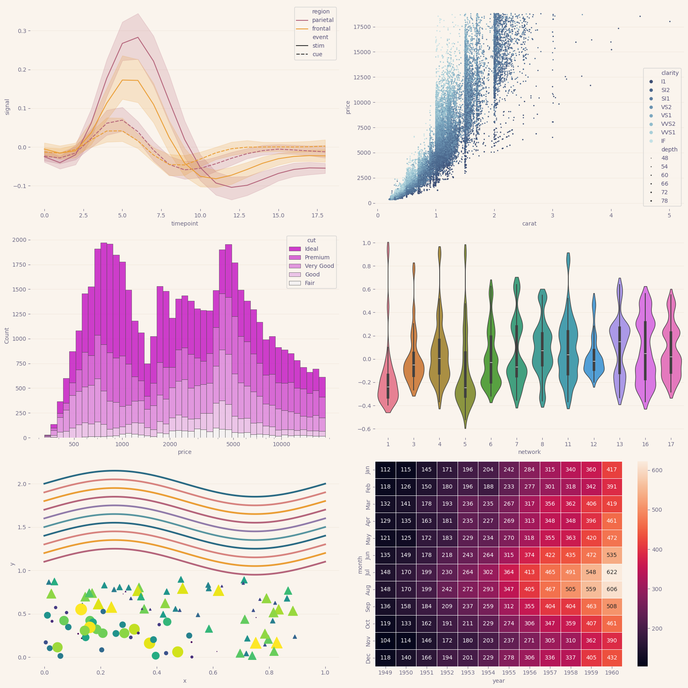
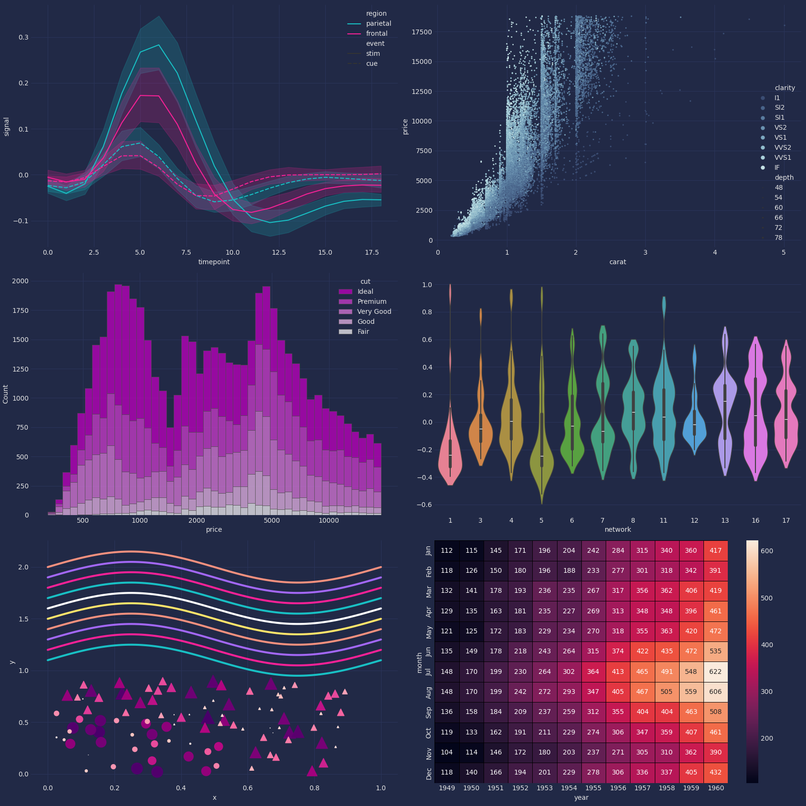
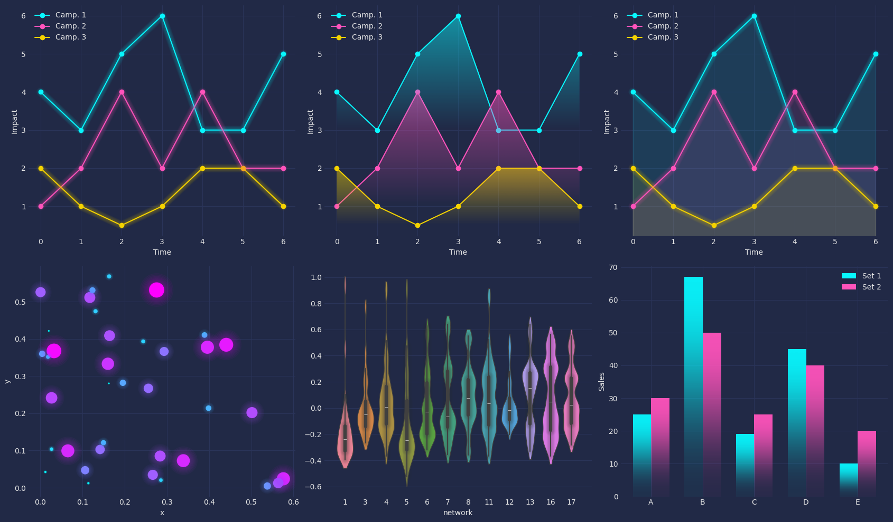

## Python Matplotlib Styling

This repository contains examples of the most prominent matplotlib and seaborn plotting library themes.
Themes are integrated either by separate python packages or as `.mplstyle` files.
To visualize examples of styling and themes, two plotting utility functions are used, creating various different graphs and plot types.

### Structure

The data is structured as follows:

* `assets` - contains separate .mplstyle theme files
* `images` - contains example snapshots of different plots
* `matplotlib.ipynb` - contains all theme and styling examples
* `plots.py` - module containing both plotting utility functions
* `utils.py` - module containing data preparation and visualization functions 

### Imports

Check `requirements.txt` for dependencies.
To run and test the different themes that are not provided as `.mplstyle` files, we make use of the following styling packages:

* `matplotx`
* `catppuccin`
* `mplcyberpunk`

### Examples

Below we include examples of dark- white- and glowing themes:

`Rose Pine Dawn`

`Pitaya Dark`

`MplCyberpunk`
